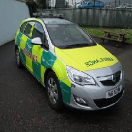

# AV-Computer-Vision
Computer Vision <a href="https://datahack.analyticsvidhya.com/contest/janatahack-computer-vision-hackathon/#About">Hackathon</a> by Analytics Vidya.

The objective of the Hackthon is to classify vehicle as emergency or not.

Pytorch has been used to work for the Project.
